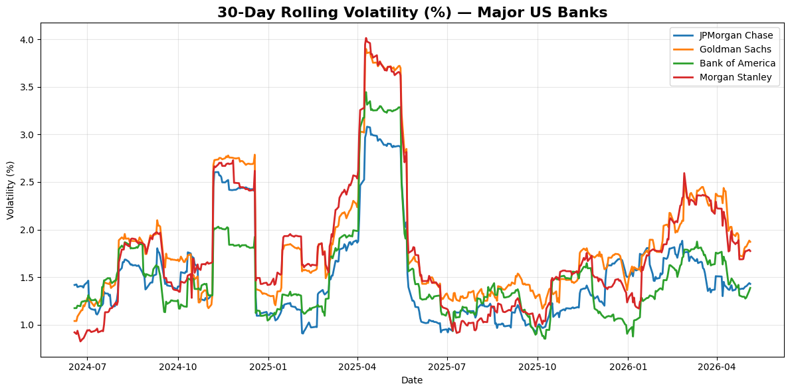

# 📊 Financial Data Analytics Portfolio
**Lucas Mesa Vidal** | Business Administration Student | HKA Karlsruhe

---

## Project 1 — US Banking Sector Stock Analysis

### Objective
Analyze and compare the stock performance of the four largest US banks 
over the last 2 years to identify trends, returns and volatility patterns.

### Companies Analyzed
| Ticker | Company |
|--------|---------|
| JPM | JPMorgan Chase |
| GS | Goldman Sachs |
| BAC | Bank of America |
| MS | Morgan Stanley |

### Key Findings
- **Highest return:** Goldman Sachs (~115%) — best performer over the period
- **Lowest return:** Bank of America (~47%) — significantly behind peers
- **Most volatile:** Morgan Stanley — peaked at 4.0% in April 2025
- **Most stable:** JPMorgan Chase — consistently lowest volatility
- **Notable event:** All 4 banks showed a sharp volatility spike in 
  April 2025, likely driven by macro uncertainty (tariff announcements)
- **Overall trend:** Entire sector delivered strong positive returns, 
  with Goldman Sachs and Morgan Stanley leading at ~115% and ~111%

### Tools Used
Python · Pandas · Matplotlib · yfinance · Google Colab

### Visualizations

